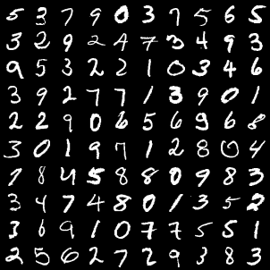
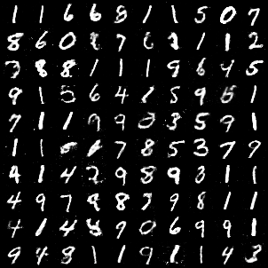
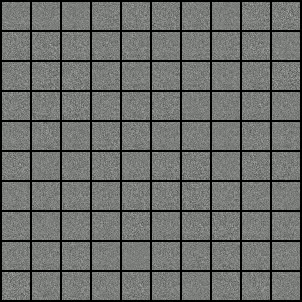

# MNIST_GANs

Handwritten digits image generation using GANs (Generative Adversarial Networks) using PyTorch and MNIST Dataset.

## Getting Started

- Download the code
- Execute each cell in the `MNIST_GANs_using_PyTorch.ipynb`.

**REAL IMAGES** used for training.

**GENERATED IMAGES** after training.

Evolution of the generated images.

